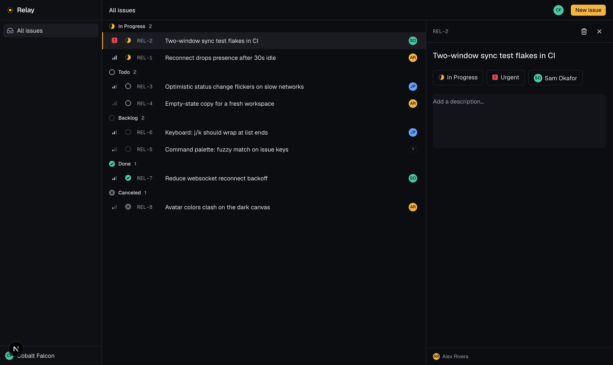

# Relay

A fast, keyboard-driven issue tracker where a team's edits and presence sync live across every
open tab. It is a focused "Linear-lite" built to show a real-time sync engine rather than basic CRUD.


The clip above is two separate browser sessions side by side. A change in the left window (a new
issue, a status change, a title typed one character at a time) lands in the right window with no
refresh, and each session sees the other's presence and which field is being edited.



## What it does

- Issues with the fields a real tracker needs: title, description, status, priority, assignee, an
  `REL-` key, grouped by status.
- Real-time sync. Every create, edit, and delete reaches all connected clients over a websocket.
  No polling, no refresh button.
- Presence. Live avatars of who is online, who is viewing an issue, and who is editing which field.
- Optimistic UI. Your own actions apply instantly and roll back on their own if the server rejects
  them.
- Reconnect and reconciliation. Drop the connection and edits queue locally, then flush and
  reconcile to the server when you are back. An indicator shows the state.
- Keyboard first. `Cmd+K` command palette, `j`/`k` to move, `c` to create, `/` to search, `Esc` to
  close.

## How the sync engine works

The interesting part is the path one edit travels.

1. Click to optimistic update. Changing a status calls a Convex mutation with an optimistic update
   (`hooks/use-update-issue.ts`) that patches the local cache right away, so the screen changes
   before the network answers.
2. Server write. The mutation runs on Convex and writes to the database, the single source of truth
   (`convex/issues.ts`). `updatedAt` is stamped on the server.
3. Reactive fan-out. Convex re-runs every query touched by that write and pushes fresh results down
   the websocket to every subscribed client, including the one that made the change, whose
   optimistic value is replaced by the confirmed one. Subscribing to a query with `useQuery` is the
   subscription, so the app never polls.
4. Presence. Each tab sends a heartbeat (`convex/presence.ts`) every five seconds with its
   `lastSeen` time, the issue it is viewing, and the field it is editing. "Online" is computed on
   the client as `lastSeen` within a 15 second window, so a closed tab drops off on its own.
5. Reconnect and reconciliation. The Convex client keeps the websocket alive and reconnects on its
   own. Queued mutations flush on reconnect and the server results overwrite any stale local state.
   `hooks/use-connection.ts` drives the offline indicator.

State lives in a few clear places. The source of truth is the Convex database. The live cache is
the Convex client in memory, updated over the websocket. Optimistic changes are a short-lived
overlay on that cache. Presence is ephemeral rows queried live. UI-only state, such as which issue
is selected or whether the palette is open, is React state.

Live text editing propagates the title and description as you type (throttled to about 180ms) and
shows an "is editing" marker per field, while keeping your own cursor safe from remote overwrites
(`components/issue-detail.tsx`). This is live propagation plus editing presence. It is not full
CRDT co-typing of the same field, which is out of scope on purpose.

### Data model (`convex/schema.ts`)

- `issues`: title, description, status, priority, assigneeId, creatorId, number, updatedAt, indexed
  by status and number.
- `users`: a lightweight guest identity (name and avatar color).
- `presence`: userId, lastSeen, focusIssueId, editingField (ephemeral).
- `counters`: monotonic `REL-` numbers, incremented inside a transaction.

## Tech

TypeScript, Next.js 16 (App Router), React 19, Convex for the database and reactive websocket sync,
Tailwind CSS v4, shadcn/ui, cmdk, Geist Sans and Mono, and Playwright. It runs on the Vercel and
Convex free tiers.

## Run it locally

```bash
pnpm install
npx convex dev      # first run: log in, or pick "start without an account" for a local backend
pnpm dev            # second terminal, then open http://localhost:3000
```

Open two windows side by side to watch sync and presence. Use "Load demo data" on an empty
workspace, or "Reset demo data" from the `Cmd+K` palette, to populate it.

## Tests

```bash
pnpm test
```

Playwright drives real browsers. The suite covers a two-context test that asserts an edit in one
client shows up in another, presence counts, live text editing, reconnect reconciliation (a real
socket drop with `routeWebSocket`, since `setOffline` does not sever a loopback socket), optimistic
rollback, and the responsive layout.

## Deploy

1. Push to GitHub.
2. Import the repo on Vercel.
3. The build command is set in `vercel.json` to `npx convex deploy --cmd 'pnpm build'`.
4. Add a `CONVEX_DEPLOY_KEY` environment variable from the Convex dashboard (Settings, Deploy Keys).
   That command deploys the Convex backend and passes `NEXT_PUBLIC_CONVEX_URL` into the Next build.

## Design and scope notes

- Design direction "Graphite and Signal": layered dark graphite surfaces with one amber accent that
  means "live now", and Geist Mono reserved for machine identifiers like issue keys.
- Auth is intentionally light. Visitors get a guest identity instead of an account, because the sync
  engine is the point. Convex Auth is a clean upgrade path.
- Sync depth is scoped to real-time sync, presence, optimistic UI, and reconnect. It does not include
  full CRDT offline editing.
